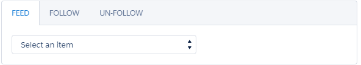
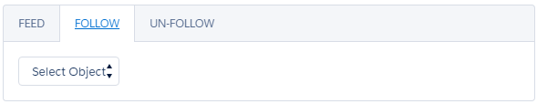
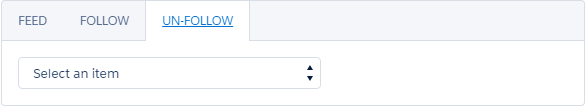

# Follow Anything (previously "BFF Follow"; still used interchangeably)
Follow Anything allows users to follow their records (Users), Accounts, Cases and topics. Users can select their followed records to see corresponding feed.

The idea is to allow users to follow defined number of  records that user is really interested in; to allow users to focus on data important to them. 

Currently, in chatter, users' feed can show all of the followed friends, records and it's hard to see record specific feed (without opening the record).

## Installation

<strong>Read Before Install</strong> 
<ul>
    <li>Make sure to give permisison on BFFFollow__c object fields to profile used in your org (even System Admin)</li>
    <li>You might also need to add Custom Object tab</li>
</ul>

You can install this from <a href="https://appexchange.salesforce.com/listingDetail?listingId=a0N3A000000s5BVUAY">AppExchange</a>
 
OR
 

## Synopsis
Users can use a  Lookup field to select Friend, Account etc and follow the record. SOSL is used to search the text for specific object type.  Returned result will show up in a list and can be followed. Followed records will show up in drop down in "Feed" tab. Selecting a record in Feed tab will use ConnectApi.ChatterFeeds.getFeedElementsFromFeed() to fetch record for a user.
 
Component uses SLDS and it's Feed component (https://www.lightningdesignsystem.com/components/feeds/) to style the feed and display to user.

How does this component will look like?

  
 
 

**Requirements**
<ul>
    <li>Chatter
        <ul><li>Access to Chatter for the user who need to use the component</li></ul>
    </li>
    <li>My Domain</li>
    <li>Allow Read/Create/Edit access on "BFFFollow" object after installation
        <ul>
            <li>Users need to upsert a record in this object to store their followed records</li>
            <li>OWD setting can be Private as users don't need to see records for other users</li>
            <li>New record will be created when record is followed; updated if there already is one</li>
        </ul>
    </li>
</ul>

## Usage ##
There are 2 ways to use this component. 
<ol>
    <li>You can use App Builder to add this component to a Lightning Page and/or tab. Or you can use latest App Builder feature to edit LEX home/record page and add the component there.</li>
    <li>You can also use this component programmatically and add it to your other components; as needed.
        <ul><li>&lt;BFFFollow:BFFFollow debug="false" maxFollowedUsers="5" /&gt;</li></ul>
    </li>
</ol>

## Technical Details ##
Events:
<ol>
    <li>COMPONENT: <strong>UpdateLookId</strong> (Lightning-Lookup)</li>
    <li>COMPONENT: <strong>ClearLookId</strong> (Lightning-Lookup)</li>
    <li>APPLICATION: <strong>BFFFollow_UsersUpdated</strong>
        <ul>
            <li>- Fired when new records are followed or followed records are removed</li>
            <li>- Idea is to update JSON list of followed records in BFFHelper which, in turn, will pass that data to other components</li>
    </li>
</ol>
    

Components:
<ul>
	<li><strong>BFFFollow</strong>
	<ul>
		<li>Global Attributes
		<ul>
			<li><strong>debug</strong>: true/false: If true then display log with console.log or System.debug (in Apex)</li>
			<li><strong>maxFollowedUser</strong>s: Number: Restricts users to follow only upto specified number of records</li>
		</ul>
		</li>
		<li>How it works
		<ul>
			<li>BFFFollow will fire a fetch event to retrieve list of followed records for current user</li>
			<li>If no records are followed then current user will be advised to follow one/more records</li>
			<li>This component has 3 tabs which include 3 components
			<ul>
				<li>First tab, <strong>BFFFollow_Feed</strong>,
				<ul>
					<li>Shows a drop down of followed records. If a friend is selected then their feed will be fetched.</li>
					<li>If No records are followed then a message will be displayed asking user to add one/more records</li>
				</ul>
				</li>
				<li>Second tab, <strong>BFFFollow_Users</strong>,
				<ul>
					<li>Has a lookup field to search for records</li>
					<li>Once a record has been searched, it will allow user to follow that record</li>
					<li>After recordfriend has been followed, a new JSON will be generated and an event fired</li>
					<li>BFFFollow will catch that event and update followedUsers attribute. which will then traverse down to other components in tabs and update their drop downs etc</li>
				</ul>
				</li>
				<li>Third tab, <strong>BFFFollow_UsersRemove</strong>,
				<ul>
					<li>Displays list of followed records as Drop down</li>
					<li>User can select a friend and decide to remove that user from the list</li>
					<li>After successful removal, component will fire event to let other components know about updated list and refresh other components</li>
				</ul>
				</li>
			</ul>
			</li>
		</ul>
		</li>
	</ul>
	</li>
</ul>

## Technical Specifications ##
 

## Credits
Following are some of the component/libraries that I have used in this component. 

<ol>
    <li>ETLC_ApexBridge
        <ol>
            <li>https://eltoro.secure.force.com/ETLC_ApexBridge</li>
            <li>http://github.com/eltoroit/ETLC_ApexBridge</li>
        </ol>
    </li>
    <li>Lookup
        <ol>
            <li>https://developer.salesforce.com/blogs/developer-relations/2015/06/salesforce-lightning-inputlookup-missing-component.html</li>
            <li>https://github.com/tscottdev/Lightning-Lookup</li>
        </ol>
    </li>
</ol>

## About Me
I, Jaswinder Rattanpal,  love to work on new things. This time, I tried my hands at creating a new Lightning Component to publish on App Exchange.

I am also an Associate Technical Evangelist working with ISV Technical Evangelists team @Salesforce.

Don't forget to visit my blog: http://www.rattanpal.com