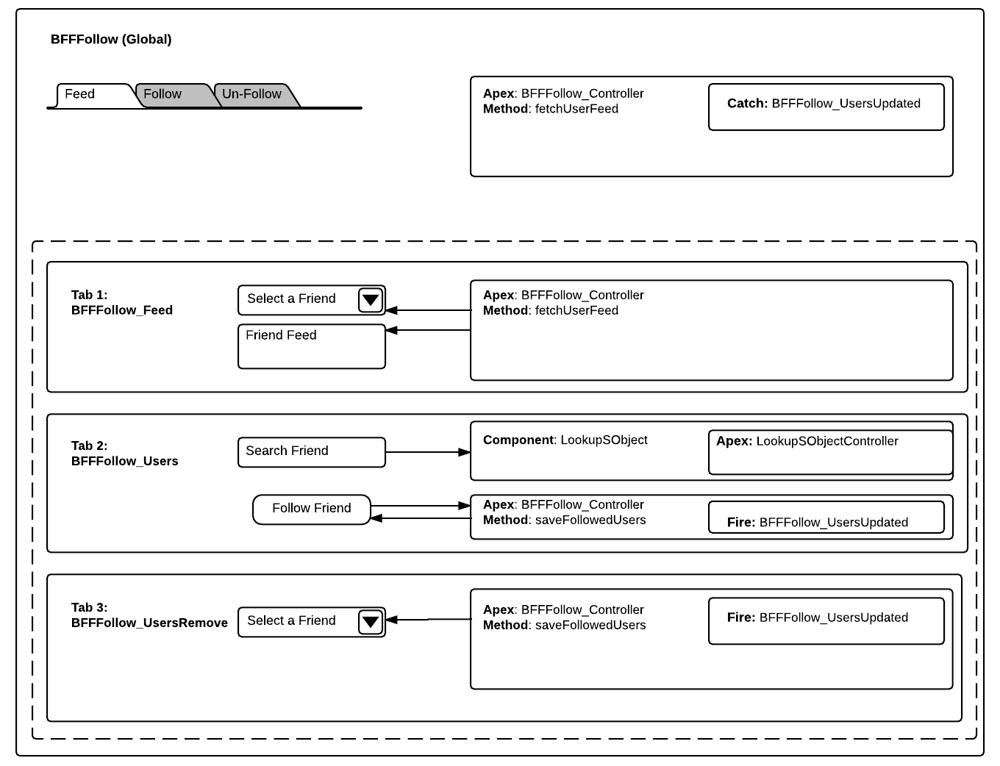

# BFFFollow
BFF Follow allows users to follow their friends. Users can select their followed friends to see their feed.

The idea is to allow users to follow 5 of the top friends they want to follow and see their feed. Currently, in chatter, users' feed can show all of the followed users (friends) and it's hard to see friend specific feed.

## Synopsis
Users can use a User Lookup field to select Friend and follow her. Followed friends will show up in a drop down in "Feed" tab. Selecting a friend in Feed tab will use ConnectApi.ChatterFeeds.getFeedElementsFromFeed() to fetch a feed for a user and return it to component.
 
Component uses SLDS and it's Feed component (https://www.lightningdesignsystem.com/components/feeds/) to style the feed and display to user.

## Installation
You can use App exchange listing to install the managed package. Or you can use following Deploy button to deploy this code to a salesforce org.

## Usage ##
There are 2 ways to use this component. 

1) You can use App Builder to add this component to a Lightning Page and/or tab. Or you can use latest App Builder feature to edit LEX home/record page and add the component there.

2) You can also use this component programmatically and add it to your other components; as needed.

<BSSFollow:BSSFollow debug="false" maxFollowedUsers="maxFollowedUsers" />

## Technical Specifications ##

## Credits

## About Me