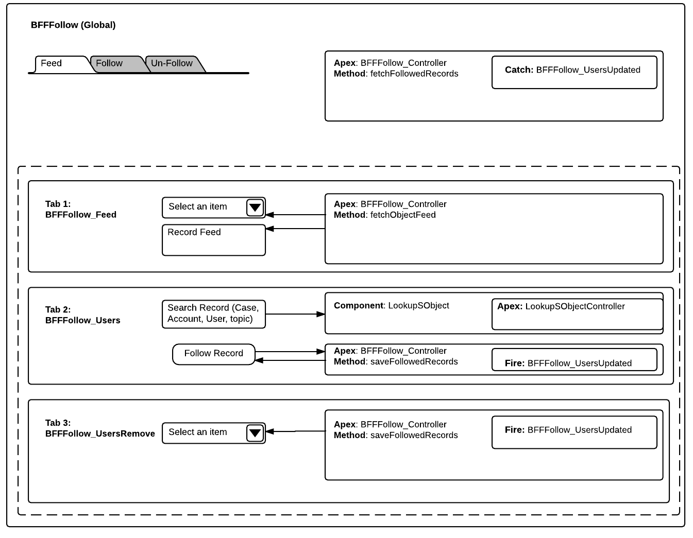

# BFFFollow
BFF Follow allows users to follow their friends. Users can select their followed friends to see their feed.

The idea is to allow users to follow 5 of the top friends they want to follow and see their feed. Currently, in chatter, users' feed can show all of the followed users (friends) and it's hard to see friend specific feed.

## Synopsis
Users can use a User Lookup field to select Friend and follow her. Followed friends will show up in a drop down in "Feed" tab. Selecting a friend in Feed tab will use ConnectApi.ChatterFeeds.getFeedElementsFromFeed() to fetch a feed for a user and return it to component.
 
Component uses SLDS and it's Feed component (https://www.lightningdesignsystem.com/components/feeds/) to style the feed and display to user.

How does this component will look like?

 

## Installation
You can use App exchange listing to install the managed package. Or you can use following Deploy button to deploy this code to a salesforce org.

**Requirements**
<ul>
    <li>Chatter
        <ul><li>Access to Chatter for the user who need to use the component</li></ul>
    </li>
    <li>My Domain</li>
    <li>Allow Read/Create/Edit access on "BFFFollow" object after installation
        <ul>
            <li>Users need to upsert a record in this object to store their followed users</li>
            <li>OWD setting can be Private as users don't need to see records for other users</li>
            <li>New record will be created when friend is followed; updated if there already is one</li>
        </ul>
    </li>
</ul>

## Usage ##
There are 2 ways to use this component. 
<ol>
    <li>You can use App Builder to add this component to a Lightning Page and/or tab. Or you can use latest App Builder feature to edit LEX home/record page and add the component there.</li>
    <li>You can also use this component programmatically and add it to your other components; as needed.
        <ul><li>&lt;BSSFollow:BSSFollow debug="false" maxFollowedUsers="5" /&gt;</li></ul>
    </li>
</ol>

## Technical Details ##
Events:
<ol>
    <li>COMPONENT: **UpdateLookId** (Lightning-Lookup)</li>
    <li>COMPONENT: **ClearLookId** (Lightning-Lookup)</li>
    <li>APPLICATION: **BFFFollow_UsersUpdated**
        <ul>
            <li>- Fired when new friends are followed or user removed old followed friend</li>
            <li>- Idea is to update JSON list of followed friends in BFFHelper which, in turn, will pass that data to other components</li>
    </li>
</ol>
    

Components:
<ul>
	<li>**BFFFollow**
	<ul>
		<li>Global Attributes
		<ul>
			<li><strong>debug</strong>: true/false: If true then display log with console.log or System.debug (in Apex)</li>
			<li><strong>maxFollowedUser</strong>s: Number: Restricts users to follow only upto specified number of users</li>
		</ul>
		</li>
		<li>How it works
		<ul>
			<li>BFFFollow will fire a fetch event to retrieve list of followed friends for current user</li>
			<li>If no friends are followed then current user will be advised to follow one/more friends</li>
			<li>This component has 3 tabs which include 3 components
			<ul>
				<li>First tab, **BFFFollow_Feed**,
				<ul>
					<li>Shows a drop down of followed friends. If a friend is selected then their feed will be fetched.</li>
					<li>If No friends are followed then a message will be displayed asking user to add one/more friends</li>
				</ul>
				</li>
				<li>Second tab, **BFFFollow_Users**,
				<ul>
					<li>Has a lookup field to search for users</li>
					<li>Once a user has been searched, it will allow user to select that user as friend and add it to their followed users</li>
					<li>After friend has been followed, a new JSON will be generated and an event fired</li>
					<li>BFFFollow will catch that event and update followedUsers attribute. which will then traverse down to other components in tabs and update their drop downs etc</li>
				</ul>
				</li>
				<li>Third tab, **BFFFollow_UsersRemove**,
				<ul>
					<li>Displays list of followed friends as Drop down</li>
					<li>User can select a friend and decide to remove that user from the list</li>
					<li>After successful removal, component will fire event to let other components know about updated list and refresh other components</li>
				</ul>
				</li>
			</ul>
			</li>
		</ul>
		</li>
	</ul>
	</li>
</ul>

## Technical Specifications ##
 

## Credits
Following are some of the component/libraries that I have used in this component. 

<ol>
    <li>ETLC_ApexBridge
        <ol>
            <li>https://eltoro.secure.force.com/ETLC_ApexBridge</li>
            <li>http://github.com/eltoroit/ETLC_ApexBridge</li>
        </ol>
    </li>
    <li>Lookup
        <ol>
            <li>https://developer.salesforce.com/blogs/developer-relations/2015/06/salesforce-lightning-inputlookup-missing-component.html</li>
            <li>https://github.com/tscottdev/Lightning-Lookup</li>
        </ol>
    </li>
</ol>

## About Me
I, Jaswinder Rattanpal,  love to work on new things. This time, I tried my hands at creating a new Lightning Component to publish on App Exchange.

I am also an Associate Technical Evangelist working with ISV Technical Evangelists team @Salesforce.

Don't forget to visit my blog: http://www.rattanpal.com